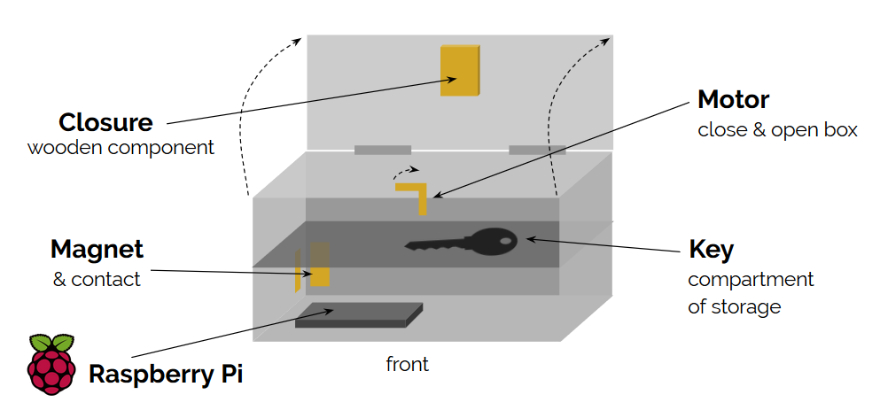

# Box for locking the key

Before starting the game, Alexa instructs the players to lock themselves in a room and store the key in the box. 
At the beginning of the game the motor closes the box. 
After the game has been played through or if the game is aborted, the motor reopens the box. 
In case of emergency, the box can also be opened from the back. 
However, this also ends the game.

## Box construction

## Install dependencies on Raspberry PI of box
- `sudo pip install -U pymodbus[twisted]`
- `sudo apt-get install build-essential libssl-dev libffi-dev python-dev`
- `sudo pip install bcrypt`
- `pip install service_identity`
